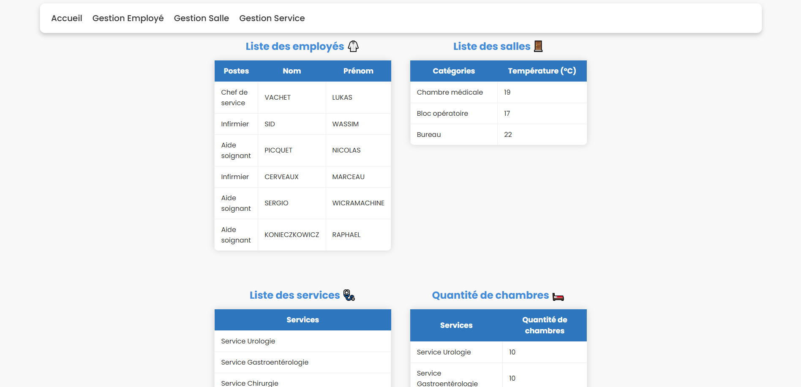

# Mini Projet Hville - Développement web

Le projet "Hville" est un mini-projet scolaire de programmation qui permet de liée **front-end** et **back-end** à travers une gestion de **base de données**. Ce projet est réalisé principalement en **PHP** mais aussi en **CSS** et **Javascript**.

---

### Aperçu



---

### Expression du besoin client

Le centre hospitalier **Hville**, cherche à mettre en place des signalétiques intelligentes au niveau des chambres médicales des différents services ainsi que les bureaux des chefs de services.

La signalétique va nous permettre de récupérer :   
▪ La température de la chambre médicalisée,   
▪ La quantité des chambres et des bureaux.

Parmi les autres besoins à prendre en compte, on trouve :   
▪ Mise en place d’une base de données avec une meilleure sécurité,   
▪ Améliorer l’accès aux ressources,   

---

### Fonctionnalités

- **Gestion des chambres et bureaux** : Enregistrement et affichage des données sur les chambres et bureaux.
- **Affichage dynamique** : Consultation en temps réel des températures et numéros des chambres.
- **Sécurisation des accès** : Gestion des utilisateurs avec des permissions spécifiques.
- **Interface intuitive** : Une interface utilisateur simple et ergonomique.

---

### Objectifs

Ce projet vise à renforcer nos compétences en développement web, en particulier en **PHP**, **MySQL**, **CSS** et **Javascript** tout en permettant de réaliser un projet concret et utile dans un cadre médical.

---

### Installation

Clonez ce dépôt sur votre machine locale :
   ```bash
   git clone https://github.com/enzo-mensier/Hville.git